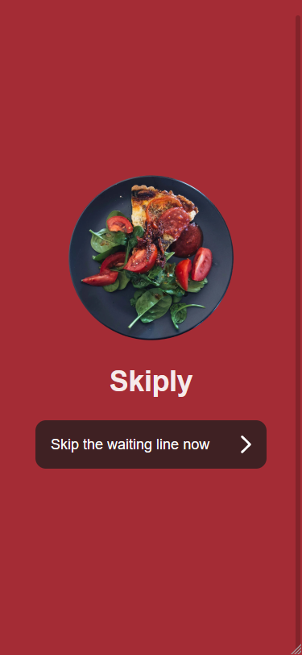
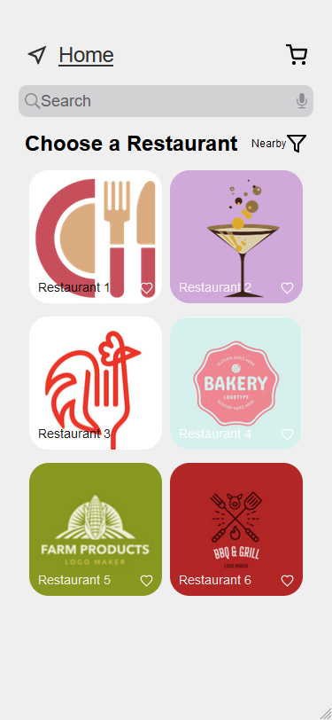
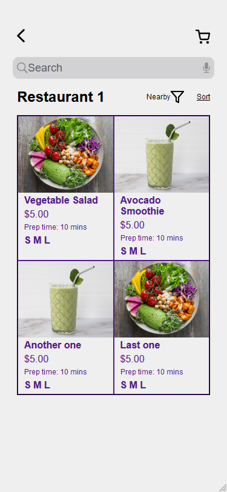
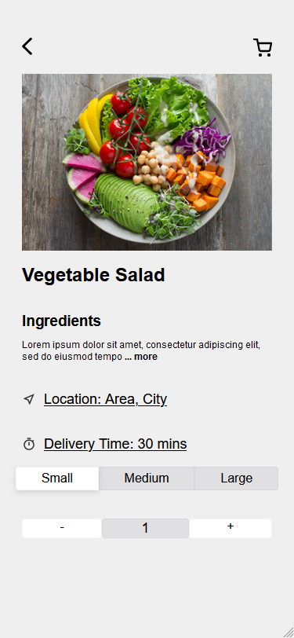

# skiply
Small concept food delivery app. To showcase what I learned in my internship at Syenchron.

Designed in Figma. Built with HTML/CSS/JavaScript.

Best viewed in your browswer's responsive design mode using <code>ctrl+shift+m</code> (on Firefox at least) with a resolution of <code>375 x 812</code>.

<table>
<tr>
<th align="center">

 
<small>
Splash Screen
</small>

</th>
<th align="center">

 
<small>
Restaurant View
</small>

</th>
</tr>
<tr>
<td>
</img>
</td>
<td>
</img>
</td>
</tr>
<tr>
<th align="center">

 
<small>
Menu View
</small>

</th>
<th align="center">

 
<small>
Meal View
</small>

</th>
</tr>
<tr>
<td>
</img>
</td>
<td>
</img>
</td>
</tr>
</table>
